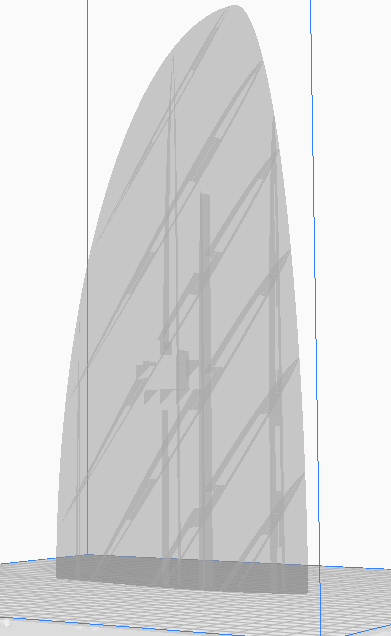
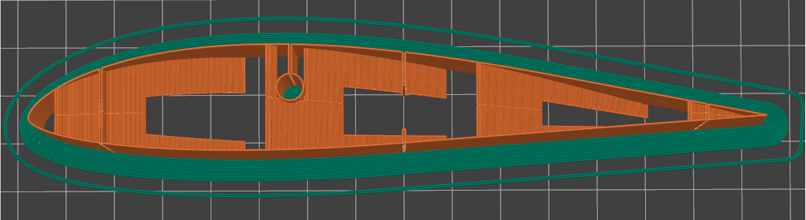
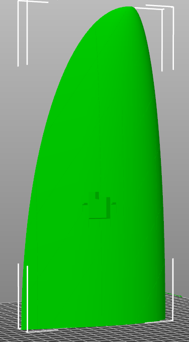
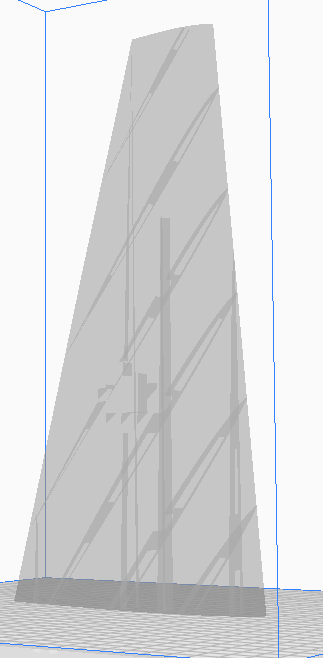
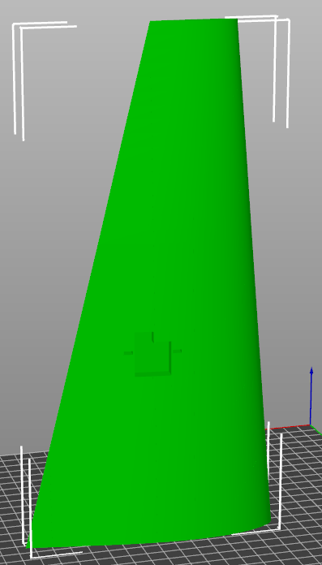

# Vase-Wing
Vase Wing is an OpenSCAD vase-mode 3D printable wing generator.

## Table of Contents

- [About](#about)
- [Installation](#installation)
- [Usage](#usage)
- [Contributing](#contributing)
- [License](#license)

## About

This project is still a work in progress.

Vase Wing is an OpenSCAD vase-mode 3D printable wing generator designed for creating wings for RC planes. It supports slicing with PrusaSlicer, Cura, and potentially other software.

The tool consists of several parts. For most users, opening the Vase-Wing.scad file in OpenSCAD should be sufficient to generate wings.

There is also a Python scraper that collects data from the m-selig (http://m-selig.ae.illinois.edu/ads/coord_database.html) database. It uses aerosandbox (https://github.com/peterdsharpe/AeroSandbox) to increase the number of points on the DAT file, resulting in smoother airfoils.

Additionally, I utilized the Perl script from https://github.com/guillaumef/openscad-airfoil to generate the necessary SCAD paths in the OpenSCAD scripts.

The wing construction technique was adapted from the Propeller Generator by BouncyMonkey, available here: https://www.thingiverse.com/thing:3506692

## Installation

If you only want to create wings using the provided airfoils, you need to install OpenSCAD.

For the scraper, you will need Python, BeautifulSoup, and aerosandbox.

Refer to https://github.com/guillaumef/openscad-airfoil for instructions on using the Perl script.

## Usage

-----------------------------------------------------------
This is a fairly complicated render so takes time in the normal OpenSCAD application. At this time there is a new geometry engine called Manifold that is being implemented that is easily 100x faster than the old CSG one but it is only available in the Developer builds at the moment. To use it do the following:

Install the newest Development Snapshot of OpenSCAD from here:
https://openscad.org/downloads.html#snapshots

Then go to Edit/Preferences in the menu
Click on Features icon
Select manifold checkbox 

-----------------------------------------------------------

To use the Vase-Wing.scad script, simply open it in OpenSCAD. You can customize various configurations.

First, update the "// Module for root airfoil polygon section" and add a reference for any airfoils found in the lib/openscad-airfoil folder that you want to use.

Next, modify the "// Wing airfoils" section. It allows you to specify three airfoils: one for the root, midsection, and tip. If you only want one airfoil, make them all the same.

Finally, update the "//Global Variables*//" section. Follow the comments to customize the wing's appearance.

## License

Please see the "LICENSE" for for licence information. 

